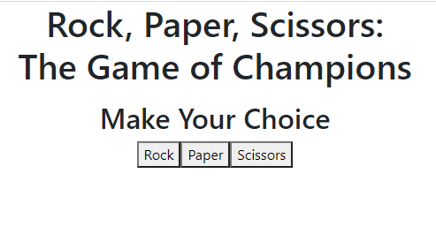
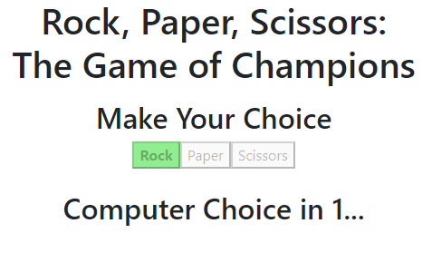
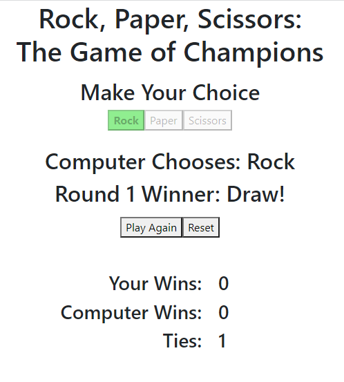

# React Rock Paper Scissors App

## Table of Contents
- [Project Overview](#project-overview)
- [Live Application](#live-application)
- [Installation](#installation)
- [License](#license)
- [Screenshots](#screenshots)

## Project Overview
Rock paper scissors client-side application built using React, Bootstrap, and JS. This app uses state hooks to track variables around the game, including human and computer selections, countdown, and score. The effect hook is used to persist the state to local storage on updates and retrieve the state from local storage when the component mounts.

Inspired by a [regular JS client-side application](https://github.com/Captain63/rock-paper-scissors-project) created for my full-stack development bootcamp using the prompt, confirm, and alert methods of the Window object.

[View the live application](https://captain63.github.io/react-rock-paper-scissors).

### Languages Used
- JavaScript (React)
- HTML
- CSS (Bootstrap)

### Node Libraries Used
- [React](https://www.npmjs.com/package/react)
- [Bootstrap](https://www.npmjs.com/package/bootstrap)
- [GH-Pages](https://www.npmjs.com/package/gh-pages)

See [package.json](./package.json) for full list of dependencies.

## Live Application
[View deployed application](https://captain63.github.io/react-rock-paper-scissors).

## Installation
To run this application on your local machine, Node.js is _required_. Once cloned/downloaded from GitHub, enter ```npm i``` in command line to install the packages referenced under Libraries Used automatically. 
You are now be ready to launch the application by entering ```npm start```.

## License
Permission is hereby granted, free of charge, to any person obtaining a copy of this Software and associated documentation files (the "Software"), to deal in the Software without  restriction, including without limitation the rights to use, copy, modify, merge, publish distribute, sublicense, and/or sell copies of the Software, and to permit persons to whom the Software is furnished to do so, subject to the following conditions.

[View the full license](./LICENSE)

## Screenshots
### Initial view


### Countdown


### Result and score
